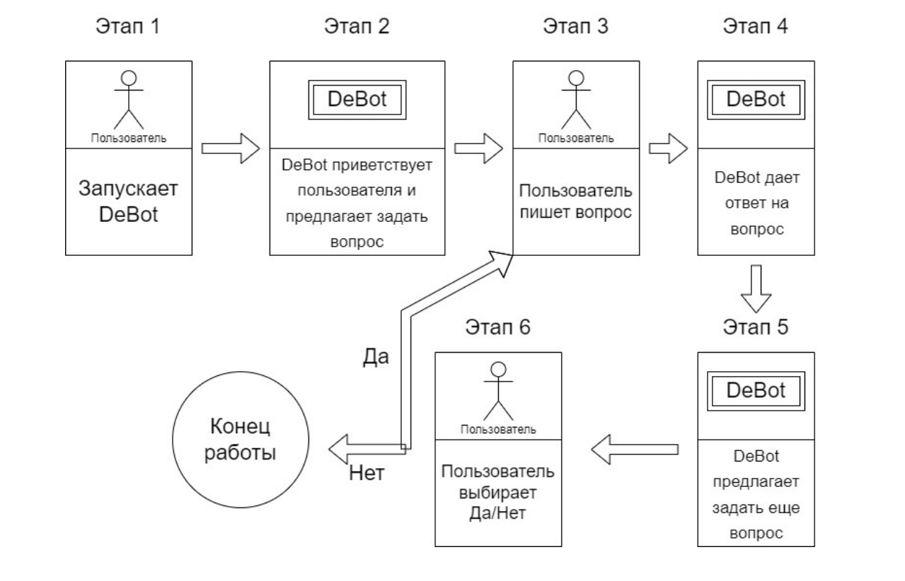

# debot-everscale-superheroes

Основан на [everscale-debot-nftauth-template](https://github.com/itgoldio/everscale-debot-nftauth-template)



Использование данного DeBot – a доступно только для владельцев NFT из коллекции [Everscale Superheroes](https://grandbazar.io/collection/Everscale_Superheroes)

## Debot info

### Адрес

```
0:f294c209d72aee0170b4f3a1b90f6bc948421fc8813563a68c09d08bf21b67c9
```

[link to ever.live](https://ever.live/accounts/accountDetails?id=0%3Af294c209d72aee0170b4f3a1b90f6bc948421fc8813563a68c09d08bf21b67c9) 

[link to tonscan.io](https://tonscan.io/accounts/0:f294c209d72aee0170b4f3a1b90f6bc948421fc8813563a68c09d08bf21b67c9) 

### Запуск в surf браузер

[link](https://uri.ever.surf/debot/0:f294c209d72aee0170b4f3a1b90f6bc948421fc8813563a68c09d08bf21b67c9)

Или отсканируйте QR через мобильное приложение


